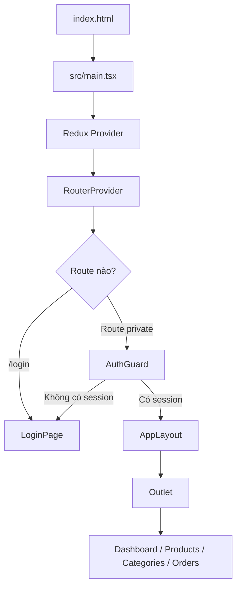
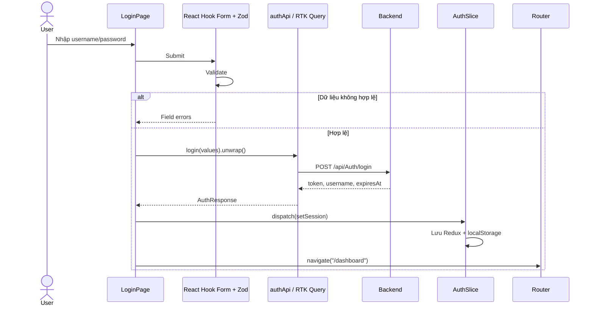
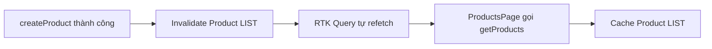
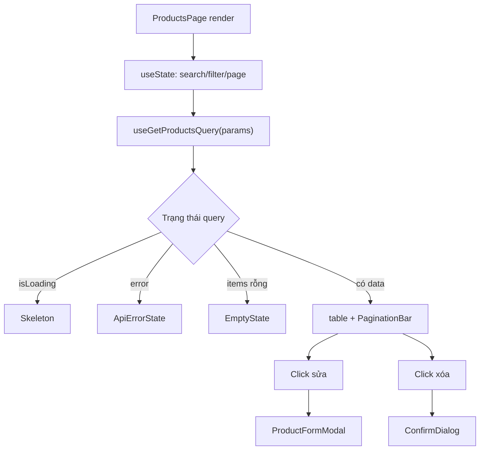
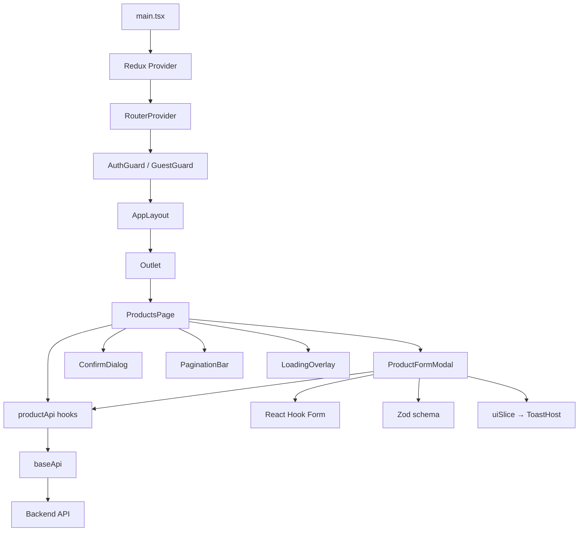

# Structure Code - Enterprise React Base

## 1. Mục đích của tài liệu

Tài liệu này giải thích toàn bộ cấu trúc, công nghệ, luồng chạy và cách xây dựng lại project từ đầu.

Project là một ứng dụng quản trị cửa hàng gồm:

- Đăng ký và đăng nhập.
- Bảo vệ route bằng JWT.
- Dashboard tổng quan.
- Quản lý sản phẩm.
- Quản lý danh mục.
- Quản lý đơn hàng.
- Search, filter, pagination.
- Validation phía frontend và lỗi validation từ backend.
- Loading, spinner, skeleton, toast, confirm modal.
- Responsive sidebar theo phong cách SB Admin 2.

Phần giao diện sử dụng HTML/CSS thuần. Project **không sử dụng CoreUI, Bootstrap hoặc một UI component library**.

---

## 2. Công nghệ đang sử dụng

| Công nghệ | Vai trò |
|---|---|
| React 19 | Xây dựng giao diện bằng component |
| TypeScript | Kiểm tra kiểu dữ liệu khi viết code |
| Vite | Dev server và production build |
| React Router | Điều hướng giữa các trang |
| Redux Toolkit | Quản lý client state |
| RTK Query | Gọi API, cache và đồng bộ server state |
| React Redux | Kết nối React với Redux store |
| React Hook Form | Quản lý dữ liệu và trạng thái form |
| Zod | Khai báo schema validation |
| `@hookform/resolvers` | Kết nối Zod với React Hook Form |
| Vitest | Unit test |
| ESLint | Kiểm tra chất lượng code |
| HTML/CSS thuần | Xây dựng giao diện theo phong cách SB Admin 2 |

Các dependency runtime hiện tại:

```json
{
  "@hookform/resolvers": "^5.4.0",
  "@reduxjs/toolkit": "^2.12.0",
  "react": "^19.2.7",
  "react-dom": "^19.2.7",
  "react-hook-form": "^7.80.0",
  "react-redux": "^9.2.0",
  "react-router-dom": "^7.18.0",
  "zod": "^4.4.3"
}
```

### 2.1. Tại sao dùng React?

React chia giao diện thành các component nhỏ:

```text
AppLayout
├── Sidebar
├── Header
├── Breadcrumb
├── Nội dung trang
└── Footer
```

Khi state thay đổi, React cập nhật phần giao diện liên quan thay vì phải thao tác DOM thủ công.

Ưu điểm:

- Component có thể tái sử dụng.
- Hệ sinh thái lớn.
- Phù hợp ứng dụng SPA.
- Tách UI thành các phần dễ quản lý.

Nhược điểm:

- Người mới phải hiểu component, props, state, hook và lifecycle.
- React chỉ xử lý UI; router, form và server state cần thư viện bổ sung.
- Dễ render lại không cần thiết nếu tổ chức state không đúng.

### 2.2. Tại sao dùng TypeScript?

TypeScript mô tả rõ dữ liệu:

```ts
export interface Product {
  id: number
  name: string
  price: number
  stock: number
  categoryId: number
}
```

Nếu truyền `price: "100"` thay vì `price: 100`, TypeScript cảnh báo trước khi chạy.

Ưu điểm:

- Phát hiện lỗi sớm.
- IDE gợi ý chính xác.
- Refactor an toàn hơn.
- Hữu ích khi API và project lớn.

Nhược điểm:

- Cần viết thêm type.
- Ban đầu có thể thấy khó vì lỗi generic hoặc type inference.
- TypeScript không kiểm tra dữ liệu thật nhận từ server tại runtime.

### 2.3. Tại sao dùng Redux Toolkit?

Redux Toolkit quản lý state dùng chung phía frontend.

Project hiện có hai Redux slice/state chính:

```text
state.auth
state.ui
```

Ví dụ client state:

- Phiên đăng nhập hiện tại.
- Sidebar đang mở hay đóng.
- Sidebar đang thu gọn hay mở rộng.
- Đang chuyển trang hay không.
- Danh sách toast.

Không lưu danh sách sản phẩm, danh mục, đơn hàng trong slice thông thường. Các dữ liệu này là server state và được RTK Query quản lý.

### 2.4. Tại sao dùng RTK Query?

RTK Query giải quyết:

- Gọi API.
- Trạng thái loading.
- Trạng thái error.
- Cache dữ liệu.
- Refetch.
- Hủy request không còn cần thiết.
- Tự gọi lại query sau create/update/delete.

Ví dụ:

```ts
const query = useGetProductsQuery({
  PageNumber: 1,
  PageSize: 10,
})
```

Hook trả về:

```ts
query.data
query.error
query.isLoading
query.isFetching
query.refetch
```

Phân biệt:

- `isLoading`: lần tải đầu, chưa có dữ liệu.
- `isFetching`: đang có request chạy, có thể vẫn còn dữ liệu cache cũ.

Ưu điểm:

- Ít code hơn `axios + useEffect + useState`.
- Cache và invalidation có sẵn.
- Tích hợp Redux DevTools.
- Sinh React hooks tự động.

Nhược điểm:

- Cần hiểu tag cache.
- Generic type có thể khó với người mới.
- Không cần thiết cho ứng dụng rất nhỏ chỉ có một vài request.

### 2.5. Tại sao dùng React Hook Form và Zod?

React Hook Form quản lý:

- Giá trị field.
- Field đã chạm hay chưa.
- Lỗi field.
- Submit state.
- Đăng ký input.

Zod định nghĩa luật validation:

```ts
const schema = z.object({
  name: z.string().min(2),
  price: z.number().min(0.01),
})
```

`zodResolver` nối hai thư viện:

```ts
useForm({
  resolver: zodResolver(schema),
})
```

Ưu điểm:

- Form ít render lại hơn cách dùng `useState` cho từng input.
- Validation tập trung.
- Có TypeScript type sinh từ schema.
- Dễ map lỗi backend về field.

Nhược điểm:

- Thêm khái niệm `register`, `setError`, `handleSubmit`.
- Input số cần chú ý `valueAsNumber`.
- Form động cần `useFieldArray`, phức tạp hơn form thường.

### 2.6. Tại sao dùng HTML/CSS thuần?

Ví dụ button:

```tsx
<button className="button button-primary" type="button">
  Thêm sản phẩm
</button>
```

Thay vì phải học API của UI library, người đọc chỉ cần hiểu HTML và CSS.

Ưu điểm:

- Dễ học và debug.
- Không bị phụ thuộc component library.
- Bundle CSS nhỏ.
- Toàn quyền chỉnh giao diện.

Nhược điểm:

- Phải tự xử lý responsive, accessibility và consistency.
- Tự viết modal, toast, pagination.
- Khi UI lớn, CSS có thể khó quản lý nếu không có convention.

---

## 3. Cấu trúc thư mục tổng thể

```text
STRUCTURE_BASE/
├── .env.example
├── .gitignore
├── eslint.config.js
├── index.html
├── package.json
├── README.md
├── Structure_Code.md
├── swagger.json
├── tsconfig.json
├── tsconfig.app.json
├── tsconfig.node.json
├── vite.config.ts
└── src/
    ├── main.tsx
    ├── vite-env.d.ts
    ├── app/
    │   ├── hooks.ts
    │   ├── routeModules.ts
    │   ├── router.tsx
    │   └── store.ts
    ├── config/
    │   ├── constants.ts
    │   └── env.ts
    ├── features/
    │   ├── auth/
    │   ├── categories/
    │   ├── dashboard/
    │   ├── orders/
    │   └── products/
    ├── layouts/
    │   └── AppLayout.tsx
    ├── shared/
    │   ├── api/
    │   ├── hooks/
    │   ├── types/
    │   ├── ui/
    │   └── utils/
    ├── styles/
    │   └── index.css
    └── test/
        └── setup.ts
```

Project dùng cách tổ chức **feature-first**:

```text
features/products
features/categories
features/orders
```

Mỗi feature chứa những file thuộc nghiệp vụ đó.

Ví dụ feature product:

```text
features/products/
├── ProductsPage.tsx
├── ProductFormModal.tsx
├── productApi.ts
└── types.ts
```

Điều này giúp khi sửa nghiệp vụ product, phần lớn file cần tìm nằm cùng một chỗ.

---

## 4. Trách nhiệm của từng thư mục

## 4.1. `src/app`

Chứa cấu hình cấp ứng dụng.

### `main.tsx`

Entry point của React:

```tsx
createRoot(root).render(
  <StrictMode>
    <Provider store={store}>
      <RouterProvider router={router} />
    </Provider>
  </StrictMode>,
)
```

Thứ tự bọc:

```text
StrictMode
└── Redux Provider
    └── RouterProvider
        └── Route/page hiện tại
```

- `StrictMode`: hỗ trợ phát hiện side effect không an toàn trong development.
- `Provider`: cho mọi component bên dưới truy cập Redux store.
- `RouterProvider`: render component theo URL.

### `store.ts`

Tạo Redux store:

```ts
reducer: {
  auth: authReducer,
  ui: uiReducer,
  [baseApi.reducerPath]: baseApi.reducer,
}
```

State có cấu trúc:

```text
state
├── auth
│   └── session
├── ui
│   ├── sidebarVisible
│   ├── sidebarUnfoldable
│   ├── navigationPending
│   └── toasts
└── api
    ├── queries
    ├── mutations
    └── cache
```

Middleware RTK Query:

```ts
getDefaultMiddleware().concat(baseApi.middleware)
```

Nếu thiếu middleware này, RTK Query không quản lý polling, invalidation, refetch và cache đúng cách.

### `hooks.ts`

Tạo typed hooks:

```ts
export const useAppDispatch = useDispatch.withTypes<AppDispatch>()
export const useAppSelector = useSelector.withTypes<RootState>()
```

Sử dụng:

```ts
const dispatch = useAppDispatch()
const session = useAppSelector((state) => state.auth.session)
```

Không nên dùng trực tiếp `useDispatch()` và `useSelector()` vì sẽ mất type.

### `router.tsx`

Khai báo route:

```text
/login
/register

AuthGuard
└── AppLayout
    ├── /dashboard
    ├── /products
    ├── /categories
    └── /orders
```

Hai guard:

- `GuestGuard`: người đã đăng nhập không quay lại login/register.
- `AuthGuard`: người chưa đăng nhập không vào trang quản trị.

Các page dùng `lazy()`:

```ts
const ProductsPage = lazy(routeModules.products)
```

Page chỉ được tải khi cần, giúp giảm JavaScript lần tải đầu.

### `routeModules.ts`

Gom dynamic import:

```ts
export const routeModules = {
  products: () => import('@/features/products/ProductsPage'),
}
```

Ngoài lazy loading, file này hỗ trợ preload:

```ts
preloadRoute('products')
```

Khi người dùng hover menu, trình duyệt tải trước JavaScript chunk. Khi click, trang mở mượt hơn.

---

## 4.2. `src/config`

### `constants.ts`

Chứa giá trị dùng chung không đổi:

```ts
APP_ROUTES
STORAGE_KEYS
PAGINATION
ORDER_STATUS
```

Lợi ích:

- Không viết lặp `"/products"` ở nhiều file.
- Đổi route tại một nơi.
- Tránh typo.

### `env.ts`

Đọc biến môi trường Vite:

```ts
export const env = {
  appName: import.meta.env.VITE_APP_NAME,
  apiUrl: import.meta.env.VITE_API_URL,
  requestTimeoutMs: ...
}
```

Biến frontend phải bắt đầu bằng `VITE_`.

Ví dụ `.env`:

```env
VITE_APP_NAME=Shop Admin
VITE_API_URL=
VITE_API_PROXY_TARGET=http://localhost:5065
VITE_REQUEST_TIMEOUT_MS=30000
```

Không đưa password, private key hoặc secret backend vào biến môi trường frontend. Mọi giá trị frontend đều có thể bị người dùng xem.

---

## 4.3. `src/features`

Chứa nghiệp vụ chính.

Quy ước một feature:

```text
features/<feature>/
├── types.ts
├── <feature>Api.ts
├── <Feature>Page.tsx
└── component phụ
```

### Feature auth

```text
auth/
├── authApi.ts
├── AuthGuard.tsx
├── authSlice.ts
├── LoginPage.tsx
├── RegisterPage.tsx
├── types.ts
└── validation.ts
```

### Feature products

```text
products/
├── productApi.ts
├── ProductFormModal.tsx
├── ProductsPage.tsx
└── types.ts
```

### Feature categories

```text
categories/
├── categoryApi.ts
├── CategoryFormModal.tsx
├── CategoriesPage.tsx
└── types.ts
```

### Feature orders

```text
orders/
├── CreateOrderModal.tsx
├── OrderDetailModal.tsx
├── OrdersPage.tsx
├── orderApi.ts
└── types.ts
```

### Feature dashboard

Dashboard gọi query từ nhiều feature:

```text
DashboardPage
├── useGetProductsQuery
├── useGetCategoriesQuery
└── useGetOrdersQuery
```

Dashboard không tạo API riêng vì dữ liệu đến từ các API đã có.

---

## 4.4. `src/layouts`

### `AppLayout.tsx`

Đây là khung giao diện sau đăng nhập:

```text
AppLayout
├── Sidebar
│   └── NavLink
├── Topbar
│   └── User menu
├── Breadcrumb
├── Main
│   └── Outlet
├── Footer
└── ToastHost
```

`Outlet` là vị trí React Router đưa page con vào:

```tsx
<main>
  <Outlet />
</main>
```

Ví dụ URL `/products`:

```text
AppLayout vẫn giữ nguyên
└── Outlet render ProductsPage
```

State sidebar lấy từ Redux:

```ts
const visible = useAppSelector((state) => state.ui.sidebarVisible)
```

Khi click:

```ts
dispatch(toggleSidebar())
```

Luồng chuyển menu:

```text
Click NavLink
→ dispatch(startNavigation())
→ URL thay đổi
→ router render page mới
→ LoadingOverlay hiển thị spinner
→ dispatch(finishNavigation())
```

---

## 4.5. `src/shared`

Chứa code dùng lại ở nhiều feature.

### `shared/api`

- `baseApi.ts`: cấu hình API chung.
- `error.ts`: chuẩn hóa lỗi.
- `error.test.ts`: test xử lý lỗi.

### `shared/hooks`

- `useDebouncedValue.ts`: delay search.
- `useApiFormError.ts`: map lỗi backend vào form.

### `shared/types`

- `PagedResult<T>`.
- `PageQuery`.
- `ProblemDetails`.
- `ApiError`.

### `shared/ui`

- `Modal`.
- `ConfirmDialog`.
- `ToastHost`.
- `LoadingOverlay`.
- `PaginationBar`.
- `PageHeader`.
- `EmptyState`.
- `ApiErrorState`.
- `Icon`.

Các component này không chứa nghiệp vụ product/category/order. Vì vậy chúng có thể dùng lại.

### `shared/utils`

- Format tiền và ngày.
- Đọc/ghi localStorage an toàn.

---

## 5. Ba loại state trong project

Đây là phần rất quan trọng.

## 5.1. Local component state

Dùng `useState`.

Ví dụ:

```ts
const [search, setSearch] = useState('')
const [editing, setEditing] = useState<Product | null>()
```

Phù hợp khi state chỉ thuộc một page/component:

- Text search.
- Modal đang mở.
- Item đang sửa.
- Filter hiện tại.

## 5.2. Form state

Dùng React Hook Form.

```ts
const {
  register,
  handleSubmit,
  setError,
  formState: { errors },
} = useForm()
```

Phù hợp với:

- Giá trị input.
- Lỗi input.
- Submit form.
- Form array.

## 5.3. Global client state

Dùng Redux slice.

```text
auth session
sidebar state
toast
navigation loading
```

State này cần được nhiều component truy cập.

## 5.4. Server state

Dùng RTK Query.

```text
products
categories
orders
```

Không copy `query.data` vào Redux slice khác hoặc local state nếu không có lý do đặc biệt. Làm vậy tạo hai nguồn dữ liệu và dễ lệch nhau.

---

## 6. Luồng chạy tổng thể



Khi ứng dụng khởi động:

1. Browser tải `index.html`.
2. `index.html` tải `/src/main.tsx`.
3. React tìm `<div id="root">`.
4. Redux Provider cung cấp store.
5. Router đọc URL.
6. Guard kiểm tra session.
7. Layout và page phù hợp được render.

---

## 7. Luồng đăng nhập



Code chính:

```ts
const session = await login(values).unwrap()
dispatch(setSession(session))
await navigate('/dashboard')
```

Tại sao dùng `.unwrap()`?

Nếu không dùng:

```ts
const result = await login(values)
```

Kết quả chứa object action của Redux.

Khi dùng:

```ts
const data = await login(values).unwrap()
```

- Thành công: trả trực tiếp response.
- Thất bại: throw error để `catch` xử lý.

---

## 8. Auth session và route guard

Session:

```ts
interface AuthResponse {
  token: string
  username: string
  expiresAt: string
}
```

`authSlice` đọc localStorage khi app khởi động:

```text
Đọc session
→ kiểm tra expiresAt
→ còn hạn: đưa vào Redux
→ hết hạn: xóa localStorage
```

`AuthGuard`:

```tsx
if (!session) {
  return <Navigate to="/login" replace />
}

return <Outlet />
```

Guard cũng đặt timeout đến thời điểm token hết hạn:

```ts
window.setTimeout(() => dispatch(clearSession()), remaining)
```

Khi backend trả `401`, `baseApi` cũng xóa session:

```ts
if (result.error?.status === 401) {
  api.dispatch(clearSession())
}
```

Như vậy có hai lớp:

1. Chủ động logout theo `expiresAt`.
2. Logout khi backend từ chối token.

Lưu ý production:

- localStorage dễ bị đọc nếu ứng dụng có lỗ hổng XSS.
- Phương án bảo mật cao hơn là access token ngắn hạn và refresh token trong HttpOnly cookie.
- Backend hiện chưa có refresh-token endpoint nên project đang theo đúng contract hiện tại.

---

## 9. Luồng gọi API

## 9.1. `baseApi`

Tất cả feature API inject vào một API gốc:

```ts
export const baseApi = createApi({
  reducerPath: 'api',
  baseQuery: baseQueryWithAuth,
  tagTypes: ['Category', 'Product', 'Order'],
  endpoints: () => ({}),
})
```

`prepareHeaders` tự gắn token:

```ts
headers.set('authorization', `Bearer ${token}`)
```

Feature không cần lặp code này.

## 9.2. Feature API

Product API:

```ts
export const productApi = baseApi.injectEndpoints({
  endpoints: (builder) => ({
    getProducts: builder.query(...),
    createProduct: builder.mutation(...),
    updateProduct: builder.mutation(...),
    deleteProduct: builder.mutation(...),
  }),
})
```

RTK Query sinh hooks:

```ts
useGetProductsQuery
useCreateProductMutation
useUpdateProductMutation
useDeleteProductMutation
```

---

## 10. Query, mutation và cache tag

### Query

Đọc dữ liệu:

```ts
getProducts: builder.query<PagedResult<Product>, ProductQuery>({
  query: (params) => ({
    url: '/api/Products',
    params,
  }),
})
```

### Mutation

Thay đổi dữ liệu:

```ts
createProduct: builder.mutation<Product, ProductRequest>({
  query: (body) => ({
    url: '/api/Products',
    method: 'POST',
    body,
  }),
})
```

### Cache tag

Query khai báo dữ liệu nó cung cấp:

```ts
providesTags: [
  { type: 'Product', id: 'LIST' }
]
```

Mutation khai báo dữ liệu nó làm cũ:

```ts
invalidatesTags: [
  { type: 'Product', id: 'LIST' }
]
```

Luồng:



Khi sửa/xóa product, category `productCount` có thể thay đổi. Vì vậy product mutation còn invalidate:

```ts
{ type: 'Category', id: 'LIST' }
```

---

## 11. Luồng trang danh sách

Ví dụ `ProductsPage`:



Page chịu trách nhiệm:

- Query params.
- Search/filter/page.
- Hiển thị table.
- Chọn item sửa/xóa.
- Mở modal.

Form modal chịu trách nhiệm:

- Validation.
- Create/update mutation.
- Map lỗi backend.
- Toast thành công.

Đây là cách tách trách nhiệm:

```text
ProductsPage
→ quản lý danh sách

ProductFormModal
→ quản lý form create/update

productApi
→ quản lý request và cache
```

---

## 12. Search debounce

Nếu gọi API ngay mỗi lần gõ:

```text
a      → request 1
ap     → request 2
app    → request 3
appl   → request 4
apple  → request 5
```

`useDebouncedValue` đợi người dùng ngừng gõ:

```ts
const debouncedSearch = useDebouncedValue(search)
```

Luồng:

```text
Người dùng gõ
→ reset timeout
→ ngừng gõ 400ms
→ debouncedSearch thay đổi
→ query gọi API
```

Ưu điểm:

- Giảm request.
- UI mượt hơn.
- Giảm tải backend.

---

## 13. Pagination

Query gửi:

```ts
{
  PageNumber: page,
  PageSize: pageSize
}
```

Backend trả:

```ts
interface PagedResult<T> {
  items: T[]
  totalCount: number
  pageNumber: number
  pageSize: number
  totalPages: number
  hasPreviousPage: boolean
  hasNextPage: boolean
}
```

`PaginationBar` chỉ nhận props và phát callback:

```tsx
<PaginationBar
  page={page}
  pageSize={pageSize}
  totalCount={data.totalCount}
  totalPages={data.totalPages}
  onPageChange={setPage}
  onPageSizeChange={setPageSize}
/>
```

`PaginationBar` không biết product/category/order. Vì vậy tái sử dụng được.

---

## 14. Form validation và lỗi backend

## 14.1. Frontend validation

Ví dụ:

```ts
name: z.string().min(2).max(200)
price: z.number().min(0.01)
stock: z.number().int().min(0)
```

Validation frontend giúp phản hồi nhanh nhưng không thay thế validation backend.

## 14.2. Backend validation

Backend có thể trả RFC 7807:

```json
{
  "title": "One or more validation errors occurred.",
  "status": 400,
  "errors": {
    "Name": ["Name already exists"],
    "Price": ["Price must be greater than zero"]
  }
}
```

`normalizeApiError` chuyển thành:

```ts
{
  title: "...",
  message: "...",
  fieldErrors: {
    name: "Name already exists",
    price: "Price must be greater than zero"
  }
}
```

`applyApiFormErrors` gọi:

```ts
setError('name', {
  type: 'server',
  message: 'Name already exists',
})
```

Kết quả: lỗi backend hiện ngay dưới đúng input.

---

## 15. Loading, spinner và tránh giao diện nháy

Project có ba loại loading:

### App loading

Dùng khi lazy loading login/register:

```tsx
<Suspense fallback={<AppLoading />}>
```

### Route loading

Dùng khi JavaScript chunk page chưa tải:

```tsx
<Suspense fallback={<RouteLoading />}>
```

### API loading

Trong page:

```tsx
<LoadingOverlay visible={query.isFetching}>
  ...
</LoadingOverlay>
```

Lần đầu:

```tsx
query.isLoading ? <PageLoading /> : ...
```

Khi refetch:

- Dữ liệu cũ vẫn giữ.
- Spinner phủ nhẹ.
- Table không biến mất.
- Giảm layout shift và cảm giác nháy.

---

## 16. Toast và confirm

Toast lưu trong Redux:

```ts
dispatch(showToast({
  color: 'success',
  title: 'Tạo sản phẩm thành công',
}))
```

`ToastHost` đọc:

```ts
const toasts = useAppSelector((state) => state.ui.toasts)
```

Mỗi toast tự xóa sau 4.5 giây.

Confirm dùng local state:

```ts
const [deleting, setDeleting] = useState<Product | null>(null)
```

```tsx
<ConfirmDialog
  visible={Boolean(deleting)}
  onConfirm={confirmDelete}
/>
```

Tại sao confirm không để trong Redux?

Vì nó chỉ thuộc page hiện tại. Redux chỉ cần thiết khi state phải dùng chung rộng hơn.

---

## 17. Luồng tạo đơn hàng

Order form dùng `useFieldArray` vì số dòng sản phẩm thay đổi:

```ts
const { fields, append, remove } = useFieldArray({
  control,
  name: 'items',
})
```

Thêm dòng:

```ts
append({
  productId: 0,
  quantity: 1,
})
```

Xóa dòng:

```ts
remove(index)
```

Trước submit, kiểm tra product trùng:

```ts
new Set(items.map(item => item.productId)).size
```

Nếu tạo order thành công:

```text
invalidate Order LIST
invalidate Product LIST
```

Product list cần refetch vì tồn kho có thể giảm.

---

## 18. Vite proxy và CORS

Frontend development chạy:

```text
http://localhost:5173
```

Backend chạy:

```text
http://localhost:5065
```

Nếu browser gọi trực tiếp khác origin, backend cần CORS.

Project dùng Vite proxy:

```ts
proxy: {
  '/api': {
    target: 'http://localhost:5065',
    changeOrigin: true,
  },
}
```

Frontend gọi:

```text
POST /api/Auth/login
```

Vite chuyển tiếp:

```text
POST http://localhost:5065/api/Auth/login
```

Lưu ý:

- Proxy này chỉ dùng với Vite dev server.
- Production cần reverse proxy Nginx/IIS hoặc cấu hình CORS backend.

---

## 19. Quan hệ giữa các component



Quy tắc phụ thuộc:

```text
shared không import feature
feature có thể import shared
layout có thể import shared và auth
app có thể kết nối mọi phần cấp cao
```

Ngoại lệ hợp lý:

- Dashboard import API hooks từ nhiều feature.
- Product form import category query để lấy option.
- Create order import product query để chọn sản phẩm.

---

## 20. Hướng dẫn tạo lại project từ đầu

Phần này giả sử bắt đầu từ thư mục trống.

## Bước 1: Tạo Vite React TypeScript

```bash
npm create vite@latest enterprise-react-base -- --template react-ts
cd enterprise-react-base
npm install
```

Chạy thử:

```bash
npm run dev
```

Mở:

```text
http://localhost:5173
```

## Bước 2: Cài dependency

```bash
npm install @reduxjs/toolkit react-redux react-router-dom react-hook-form zod @hookform/resolvers
```

Test:

```bash
npm install -D vitest jsdom @testing-library/react @testing-library/jest-dom
```

Project không cần:

```text
@coreui/*
bootstrap
axios
```

RTK Query dùng `fetchBaseQuery`, nên chưa cần Axios.

## Bước 3: Cấu hình alias `@`

Trong `tsconfig.app.json`:

```json
{
  "compilerOptions": {
    "baseUrl": ".",
    "paths": {
      "@/*": ["src/*"]
    }
  }
}
```

Trong `vite.config.ts`:

```ts
import path from 'node:path'

resolve: {
  alias: {
    '@': path.resolve(__dirname, 'src'),
  },
}
```

Sau đó:

```ts
import { store } from '@/app/store'
```

thay vì:

```ts
import { store } from '../../../app/store'
```

## Bước 4: Tạo cấu trúc thư mục

```text
src/
  app/
  config/
  features/
    auth/
    products/
    categories/
    orders/
    dashboard/
  layouts/
  shared/
    api/
    hooks/
    types/
    ui/
    utils/
  styles/
  test/
```

## Bước 5: Tạo environment

Tạo `.env.example`:

```env
VITE_APP_NAME=Shop Admin
VITE_API_URL=
VITE_API_PROXY_TARGET=http://localhost:5065
VITE_REQUEST_TIMEOUT_MS=30000
```

Tạo `src/config/env.ts`:

```ts
export const env = {
  appName: import.meta.env.VITE_APP_NAME || 'Shop Admin',
  apiUrl: import.meta.env.VITE_API_URL || '',
  requestTimeoutMs: Number(import.meta.env.VITE_REQUEST_TIMEOUT_MS || 30000),
}
```

## Bước 6: Cấu hình Vite proxy

Trong `vite.config.ts`:

```ts
server: {
  port: 5173,
  proxy: {
    '/api': {
      target: 'http://localhost:5065',
      changeOrigin: true,
      secure: false,
    },
  },
}
```

Khởi động lại Vite sau khi đổi config.

## Bước 7: Tạo shared API types

Tạo `src/shared/types/api.ts`:

```ts
export interface PagedResult<T> {
  items: T[]
  totalCount: number
  pageNumber: number
  pageSize: number
  totalPages: number
  hasPreviousPage: boolean
  hasNextPage: boolean
}

export interface PageQuery {
  PageNumber: number
  PageSize: number
  Search?: string
  SortBy?: string
  SortDirection?: 'asc' | 'desc'
}
```

Tiếp tục thêm `ProblemDetails` và `ApiError`.

## Bước 8: Tạo auth slice

Tạo:

```text
features/auth/types.ts
features/auth/authSlice.ts
```

Các reducer cần:

```ts
setSession
clearSession
```

Khi set:

```text
Redux state + localStorage
```

Khi clear:

```text
Redux state = null + xóa localStorage
```

## Bước 9: Tạo baseApi

Tạo `src/shared/api/baseApi.ts`:

```ts
const rawBaseQuery = fetchBaseQuery({
  baseUrl: env.apiUrl,
  prepareHeaders: (headers, { getState }) => {
    const token = (getState() as RootState).auth.session?.token
    if (token) {
      headers.set('authorization', `Bearer ${token}`)
    }
    return headers
  },
})
```

Bọc xử lý `401`:

```ts
if (result.error?.status === 401) {
  api.dispatch(clearSession())
}
```

Khai báo tag:

```ts
tagTypes: ['Product', 'Category', 'Order']
```

## Bước 10: Tạo Redux store

Tạo `src/app/store.ts`:

```ts
export const store = configureStore({
  reducer: {
    auth: authReducer,
    ui: uiReducer,
    [baseApi.reducerPath]: baseApi.reducer,
  },
  middleware: (getDefaultMiddleware) =>
    getDefaultMiddleware().concat(baseApi.middleware),
})
```

Tạo typed hooks trong `src/app/hooks.ts`.

## Bước 11: Tạo authApi

```ts
export const authApi = baseApi.injectEndpoints({
  endpoints: (builder) => ({
    login: builder.mutation<AuthResponse, LoginRequest>({
      query: (body) => ({
        url: '/api/Auth/login',
        method: 'POST',
        body,
      }),
    }),
  }),
})
```

## Bước 12: Tạo login validation

Trong `validation.ts`:

```ts
export const loginSchema = z.object({
  username: z.string().min(1, 'Vui lòng nhập tên đăng nhập'),
  password: z.string().min(1, 'Vui lòng nhập mật khẩu'),
})
```

## Bước 13: Tạo LoginPage

Các bước:

1. `useForm` với `zodResolver`.
2. Gọi `useLoginMutation`.
3. Submit bằng `.unwrap()`.
4. Dispatch `setSession`.
5. Navigate dashboard.
6. Catch và map error.

## Bước 14: Tạo AuthGuard

```tsx
if (!session) {
  return <Navigate to="/login" replace />
}

return <Outlet />
```

Tạo thêm `GuestGuard`.

## Bước 15: Tạo router

Khai báo:

```text
GuestGuard
├── login
└── register

AuthGuard
└── AppLayout
    ├── dashboard
    ├── products
    ├── categories
    └── orders
```

Dùng `lazy` và `Suspense`.

## Bước 16: Tạo AppLayout bằng HTML

Cấu trúc:

```tsx
<div className="admin-shell">
  <aside className="sidebar">
    <nav>...</nav>
  </aside>

  <div className="admin-wrapper">
    <header>...</header>
    <main>
      <Outlet />
    </main>
    <footer>...</footer>
  </div>
</div>
```

Không đặt nghiệp vụ API trong layout.

## Bước 17: Tạo CSS nền

Trong `styles/index.css`, tạo theo thứ tự:

1. CSS variables.
2. Reset cơ bản.
3. Sidebar/layout.
4. Button/form.
5. Card/table.
6. Modal/toast.
7. Loading.
8. Responsive media queries.

Không viết style inline trừ giá trị động thực sự.

## Bước 18: Tạo product types

Dựa theo Swagger:

```ts
export interface Product {
  id: number
  name: string
  description: string | null
  price: number
  stock: number
  categoryId: number
  categoryName: string | null
}
```

Tạo riêng:

```ts
ProductRequest
ProductQuery
```

## Bước 19: Tạo productApi

Thêm lần lượt:

```text
getProducts
getProduct
createProduct
updateProduct
deleteProduct
```

Sau mỗi mutation, khai báo `invalidatesTags`.

## Bước 20: Tạo ProductsPage

State:

```ts
search
categoryId
stockFilter
page
pageSize
editing
deleting
```

Render theo thứ tự:

```text
PageHeader
Toolbar
Loading/Error/Empty/Table
PaginationBar
ProductFormModal
ConfirmDialog
```

## Bước 21: Tạo ProductFormModal

1. Tạo Zod schema.
2. Khởi tạo React Hook Form.
3. `reset()` khi product edit thay đổi.
4. Nếu có product thì update.
5. Nếu không có product thì create.
6. Toast thành công.
7. Map lỗi backend.

## Bước 22: Làm tương tự cho category

Các file:

```text
types.ts
categoryApi.ts
CategoriesPage.tsx
CategoryFormModal.tsx
```

## Bước 23: Tạo order

Các file:

```text
types.ts
orderApi.ts
OrdersPage.tsx
CreateOrderModal.tsx
OrderDetailModal.tsx
```

Form order dùng `useFieldArray`.

## Bước 24: Tạo shared UI

Nên làm theo thứ tự:

```text
Icon
Modal
ConfirmDialog
ToastHost
LoadingOverlay
PageHeader
PaginationBar
EmptyState
ApiErrorState
```

Tránh copy modal/button/table logic vào từng feature.

## Bước 25: Tạo Dashboard

Dashboard gọi các query hiện có với `PageSize: 5`.

Không tạo API `/dashboard` nếu backend chưa có.

Nếu hệ thống lớn, nên bổ sung endpoint dashboard tổng hợp để giảm số request.

## Bước 26: Viết test

Ưu tiên test logic thuần:

```text
normalizeApiError
validation schema
utility formatter
reducer
```

Sau đó mới test component và integration.

## Bước 27: Chạy kiểm tra

```bash
npm run typecheck
npm run lint
npm run test
npm run build
```

Không chỉ chạy `npm run dev`. Dev server chạy được chưa đảm bảo production build thành công.

---

## 21. Checklist khi thêm feature mới

Ví dụ thêm customer:

```text
features/customers/
├── types.ts
├── customerApi.ts
├── CustomersPage.tsx
└── CustomerFormModal.tsx
```

Checklist:

1. Đọc Swagger.
2. Tạo request/response types.
3. Thêm tag type vào `baseApi`.
4. Inject endpoints.
5. Tạo query params.
6. Tạo page.
7. Tạo form schema.
8. Map lỗi backend.
9. Thêm route lazy.
10. Thêm menu và preload.
11. Thêm test.
12. Chạy typecheck/lint/test/build.

---

## 22. Những điều không nên làm

### Không gọi API trực tiếp trong nhiều component bằng `fetch`

Không nên:

```ts
useEffect(() => {
  fetch('/api/Products').then(...)
}, [])
```

Vì sẽ tự xử lý cache, loading, error và refetch ở từng nơi.

### Không lưu server data hai lần

Không nên:

```ts
const { data } = useGetProductsQuery()
const [products, setProducts] = useState([])

useEffect(() => {
  setProducts(data)
}, [data])
```

Trừ khi cần tạo bản draft độc lập.

### Không dùng Redux cho mọi state

Search input chỉ thuộc ProductsPage thì dùng `useState`, không cần Redux.

### Không viết URL rải rác

Dùng `APP_ROUTES`.

### Không dùng `any`

Nếu chưa biết type, bắt đầu bằng `unknown`, sau đó kiểm tra.

### Không tin hoàn toàn frontend validation

Backend luôn phải validate lại.

### Không để secret trong `.env` frontend

Biến Vite được đóng gói vào JavaScript trình duyệt.

---

## 23. Hướng phát triển tiếp theo

Để nâng project lên hệ thống doanh nghiệp lớn hơn:

1. Thêm refresh token an toàn.
2. Thêm role và permission guard.
3. Thêm Error Boundary cấp React.
4. Thêm logging như Sentry.
5. Thêm MSW cho API mock/test.
6. Thêm Playwright end-to-end test.
7. Thêm i18n nếu hỗ trợ nhiều ngôn ngữ.
8. Chia CSS theo layer hoặc CSS Modules khi giao diện lớn.
9. Sinh API types từ OpenAPI để giảm sai lệch Swagger.
10. Thêm CI chạy lint/test/build khi tạo pull request.
11. Thêm endpoint dashboard tổng hợp.
12. Thêm Docker và cấu hình reverse proxy production.

---

## 24. Thứ tự học project đề xuất

Không cần đọc mọi file cùng lúc. Nên học theo thứ tự:

```text
1. main.tsx
2. router.tsx
3. AppLayout.tsx
4. ProductsPage.tsx
5. productApi.ts
6. baseApi.ts
7. store.ts
8. ProductFormModal.tsx
9. error.ts + useApiFormError.ts
10. authSlice.ts + AuthGuard.tsx
11. shared/ui
12. CSS
```

Câu hỏi cần tự trả lời sau khi học:

1. Khi URL đổi, component nào quyết định page được render?
2. `Outlet` dùng để làm gì?
3. Tại sao product data không nằm trong `productSlice`?
4. `isLoading` khác `isFetching` thế nào?
5. `invalidatesTags` làm gì?
6. Khi API trả `401`, session bị xóa ở đâu?
7. Khi API trả lỗi field, lỗi đi từ backend tới input như thế nào?
8. State nào dùng `useState`, state nào dùng Redux?
9. Tại sao modal form tách khỏi page danh sách?
10. Vite proxy giải quyết vấn đề gì?

Nếu trả lời được các câu này, bạn đã hiểu phần lớn kiến trúc của project.

